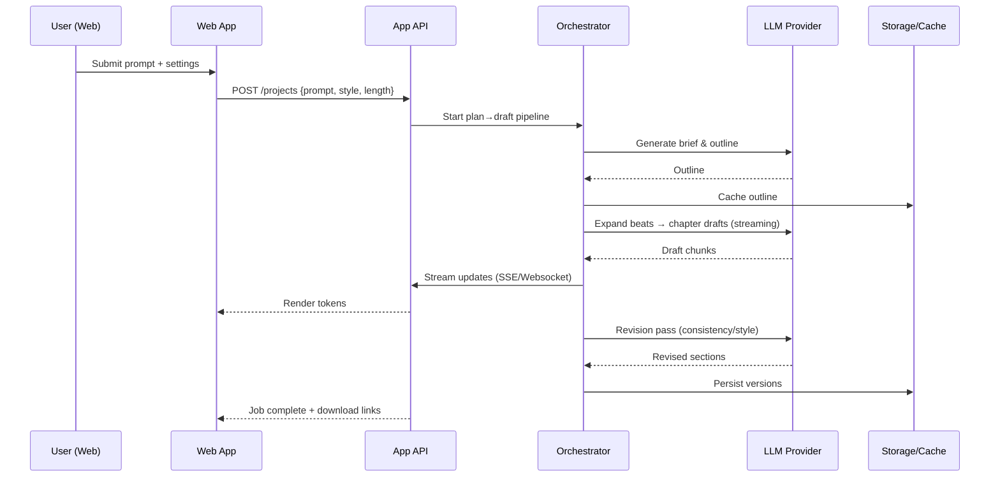

# Long-form Story Generator — ARCHITECTURE.md

> LLM-driven web tool that produces structured, coherent narratives from prompts. Demo uses synthetic inputs and mock storage.

## High-Level Components

- **Web App (UI)**
  - Prompt form, outline editor, chapter/section viewer.
  - Streaming token display; autosave drafts.
  - Optional roles: viewer/author.

- **Application API**
  - Orchestrates multi-step generation: brief → outline → beats → drafts → revision.
  - Prompt templates, content constraints, safety filters.
  - Async jobs + progress endpoints; caching of intermediate artifacts.

- **Generation Engine**
  - LLM Provider(s): OpenAI/Anthropic/local (via Text Generation Inference).
  - Planners: outline/beat planner prompts; style adapters.
  - RAG (optional): retrieve style guides or canon notes from a vetted corpus.
  - Post-processors: formatting, section stitching, length/consistency checks.

- **Storage**
  - Demo: mock store / ephemeral JSON.
  - Production: Postgres for projects; object store for versions; Redis for caches.

- **Safety & Quality**
  - Input moderation, output filters, banned topic lists.
  - Hallucination guards: schema validators, length bounds, reference checks.

- **Observability**
  - Request/latency metrics, token usage, failure traces, prompt/version logs.

## Request Flow



## Orchestration Stages

1. **Brief Normalization**: sanitize prompt, expand synopsis, extract entities.
2. **Outline Planning**: section count, arc shape, POV, constraints.
3. **Beat Generation**: per-section bullet beats with word budgets.
4. **Drafting**: streaming generation per section; enforce schema and length.
5. **Revision Loop**: style harmonization, continuity checks, profanity/safety pass.
6. **Export**: compile to Markdown/Docx; create versioned snapshot.

## Minimal vs. Production

- **Minimal (demo)**
  - Next.js/React SPA → FastAPI.
  - One LLM provider; synchronous runs; mock JSON store.
  - In-memory cache; no auth.

- **Production**
  - Auth (OAuth/OpenID), RBAC.
  - Async workers (Celery/RQ) with Redis; resumable jobs.
  - Vector store (FAISS/PGVector) for style/canon RAG.
  - Observability: OpenTelemetry, Prometheus/Grafana.
  - Rate limiting and content moderation gateways.

## Repository Layout

```
story-gen/
├── app/                    # FastAPI app, routers
├── orchestrator/           # pipeline stages, validators
├── prompts/                # Jinja templates for stages
├── web/                    # Next.js UI
├── workers/                # async tasks, queues
├── storage/                # DAL for Postgres/Redis/Objects
└── tests/
```

## API Sketch

```http
POST /projects
GET  /projects/:id/status
POST /projects/:id/continue   # resume/next stage
POST /projects/:id/revise     # targeted edits
GET  /projects/:id/export?fmt=md|docx
```
