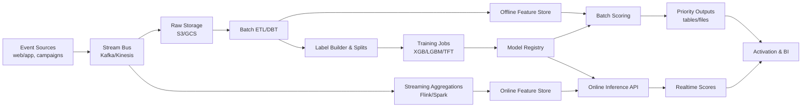

# Signal-Fusion Forecasting — ARCHITECTURE.md

> Design for a forecasting pipeline that blends behavioral and engagement signals to prioritize content/campaigns. Internal sources and figures are not disclosed.

## High-Level Components

- **Event Ingestion**
  - Sources: app/web events, impressions, clicks, dwell time, campaign metadata.
  - Transport: Kafka / Kinesis → raw object store (S3/GCS) + stream sink (Delta/BigQuery).

- **Data Processing & Feature Engineering**
  - Batch ETL: Spark/DBT for sessionization, aggregation windows (1h/24h/7d), lagged stats.
  - Real-time features: Flink/Spark Structured Streaming for low-latency counters.
  - Feature Store: Feast/Tecton to serve offline/online parity.

- **Labeling & Target Construction**
  - Targets: engagement rate uplift, next-period conversions, or demand proxy (e.g., views@T+24h).
  - Leakage/causality guards: time-based splits, campaign holdouts.

- **Modeling**
  - Algorithms: Gradient Boosted Trees (XGBoost/LightGBM/CatBoost) baseline; optional seq models (Temporal Fusion Transformer) for hierarchies.
  - Training Orchestration: Airflow/Prefect; experiment tracking with MLflow/W&B.
  - Hyperparameter Tuning: Optuna/Ray Tune.

- **Serving**
  - Offline scoring: daily priority lists per content/campaign.
  - Online inference API: FastAPI/TorchServe with online features; Redis/Bigtable cache.
  - Business policy layer: caps, pacing, eligibility.

- **Monitoring & Governance**
  - Data quality: Great Expectations.
  - Model: drift, performance, latency SLIs; canary scoring; shadow runs.
  - Observability: Prometheus + Grafana; alerting in PagerDuty.
  - Privacy/Security: PII hashing, row-level access controls, audit logs.

## Data Flow



## Key Tables

- `events_*`: raw click/view/session events.
- `content_dim`, `campaign_dim`: metadata + eligibility.
- `features_*`: offline features (parquet/Delta) with `entity_id`, `as_of_time`.
- `features_online`: parity in feature store.
- `labels_*`: supervised targets with prediction/label times.
- `scores_*`: batch/online predictions + versioning.

## Minimal vs. Production

- **Minimal (prototype):** Cron ETL (Pandas/DBT), LightGBM, SQLite/Parquet features, batch-only scoring to a priority CSV.
- **Production:** Stream + batch features, Feast/Tecton, model registry, canaries, online scoring with p95 < 50 ms, blue-green deploys.


## Tech Stack

| Layer       | Minimal                | Production                    |
|-------------|------------------------|-------------------------------|
| Ingestion   | Python cron, CSV       | Kafka, Kinesis                |
| Storage     | Parquet (local/S3)     | S3, GCS, Delta, BigQuery      |
| Transform   | Pandas, DBT            | Spark, Flink, DBT             |
| Features    | Local Parquet          | Feast, Tecton                 |
| Modeling    | LightGBM, XGBoost      | LGBM, TFT, MLflow, Registry   |
| Serving     | Batch files            | FastAPI, Redis, Bigtable      |
| Monitoring  | Logs                   | Prometheus, Grafana, GE       |

## APIs

```http
POST /score/batch            # triggers daily batch scoring
GET  /scores/:date           # fetches priority table for date
POST /predict                # realtime scoring (JSON features)
GET  /healthz
```
